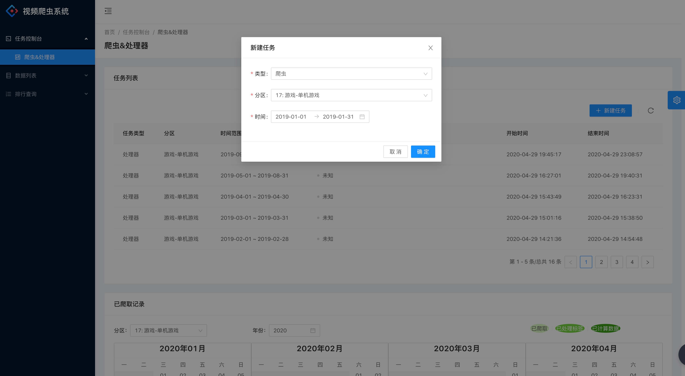
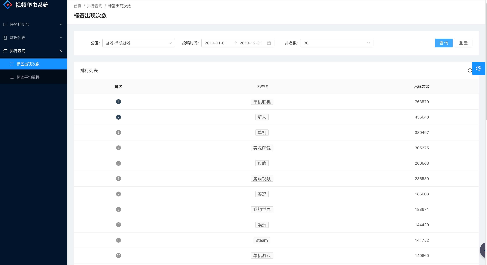
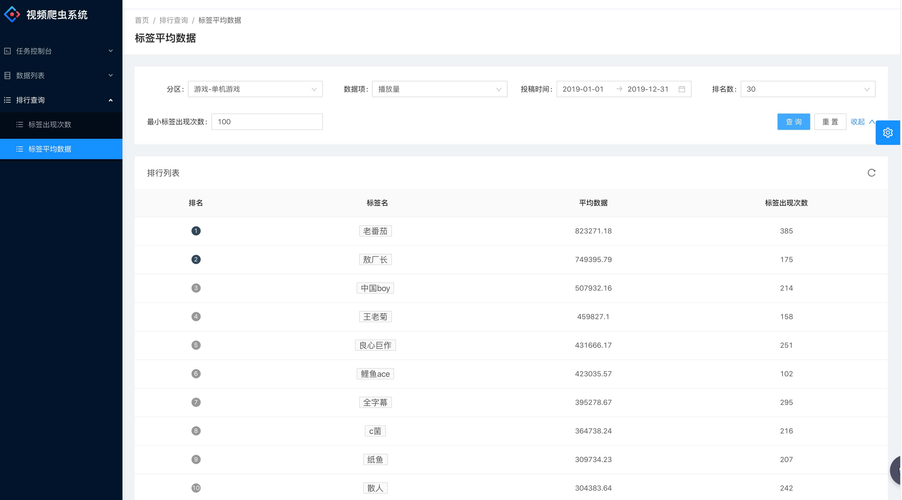

# BilibiliTagSpider

该项目目的是爬取 bilibili 视频信息数据，并提取标签，以进行时间相关的标签排行榜查询。

## 简介

-   使用 pipenv 管理依赖版本。
-   基于 Scrapy 开发，使用 MongoDB 存储数据，使用 Scrapy-Redis 实现分布式爬虫。
-   参考 [proxy_pool](https://github.com/jhao104/proxy_pool) 实现基于 Redis 的代理 IP 池。
-   Django + django-rest-framework + djongo 搭建服务端。
-   Celery 异步启动爬虫程序。
-   Ant Design Pro 搭建 Web 前端。
-   可查询指定时间区间、同一分区的视频内，每个标签的出现次数排行，和每个标签的平均数据项。

## 截图








## 安装与配置

本地安装 pipenv：
```shell
pip install pipenv
```

获取源码：
```shell
git clone https://github.com/DDDDEEP/BilibiliTagSpider.git
```

安装项目依赖：
```shell
# /BilibiliTagWeb
# /ProxyPool
# 分别在上面目录下运行命令：
pipenv install
```

拷贝配置模板文件：
```shell
cp /BilibiliTagWeb/settings.py.default /BilibiliTagSpider/BilibiliTagWeb/settings.py

cp /BilibiliTagWeb/BilibiliTagWeb/settings.py.default /BilibiliTagSpider/BilibiliTagWeb/BilibiliTagWeb/settings.py

cp /BilibiliTagWeb/BilibiliTagSpider/settings.py.default /BilibiliTagSpider/BilibiliTagWeb/BilibiliTagSpider/settings.py

cp /ProxyPool/proxypool/setting.py.default /BilibiliTagSpider/ProxyPool/proxypool/setting.py
```

Scrapy 配置项：
```python
# /BilibiliTagWeb/BilibiliTagSpider/settings.py

# MongoDB 配置
MONGO_URI = 'localhost'
MONGO_DB = 'bilibili_tag'
MONGO_USR = 'root'
MONGO_PWD = 'root'

# 获取代理的地址
PROXY_URL = 'http://127.0.0.1:5555/random'

# 是否启用分布式爬虫配置
ENABLE_SCRAPY_REDIS = False

# Redis 配置
REDIS_PORT = 6379
REDIS_HOST = 'localhost'
REDIS_PARAMS = {
    'password': 'root',
}
```

Django 配置项：
```python
# /BilibiliTagWeb/BilibiliTagWeb/settings.py

# MongoDB 配置
DATABASES = {
    'default': {
        'ENGINE': 'djongo',
        'NAME': 'bilibili_tag',
        'HOST': '127.0.0.1',
        'USER': 'root',
        'PASSWORD': 'root'
    }
}

# Celery 对应的 Redis broker 的配置
REDIS_HOST = '127.0.0.1'
REDIS_PASSWORD = 'root'
```

代理池配置项：
```python
# /ProxyPool/proxypool/setting.py

# Redis 配置
REDIS_HOST = '127.0.0.1'
REDIS_PORT = 6379
REDIS_PASSWORD = 'root'
```

如果需要使用代理池，则需要自定义 `/BilibiliTagSpider/ProxyPool/proxypool/getter.py` 中 `Crawler` 类的 `crawl_` 方法。

如果不使用代理，可以关闭 Scrapy 对应的中间件为：
```python
DOWNLOADER_MIDDLEWARES = {
    'scrapy.downloadermiddlewares.useragent.UserAgentMiddleware': None,
    # 'BilibiliTagSpider.middlewares.ProxyMiddleware': 350,
    # 'scrapy.downloadermiddlewares.httpproxy.HttpProxyMiddleware': 400,
    'BilibiliTagSpider.middlewares.RandomUserAgentMiddlware': 555,
}
```

前端代理地址配置：
```javascript
/* /BilibiliTagWeb/front_end/config/proxy.ts */
// Django 地址
test: {
    '/api/': {
        target: 'http://127.0.0.1:8000',
        changeOrigin: true,
        pathRewrite: { '^': '' },
    },
},
```
## 运行

运行代理池：
```bash
# /ProxyPool
pipenv run python run.py
```

运行 Celery：
```bash
# /BilibiliTagWeb
pipenv run celery -A BilibiliTagWeb worker
```

Django 数据迁移：
```bash
# /BilibiliTagWeb
pipenv run python manage.py migrate
```

运行 Django：
```bash
# /BilibiliTagWeb
pipenv run python manage.py runserver
```

安装前端依赖：
```bash
# /BilibiliTagWeb/front_end
npm install
```

运行前端：
```bash
# /BilibiliTagWeb/front_end
npm run start:test
```

此时即可访问前端页面。

其它命令行：
```bash
# /BilibiliTagWeb
# 运行单机爬虫
pipenv run scrapy crawl tag_spider -a type_id=17 -a time_from=20160101 -a time_to=20160101

# 运行分布式初始化脚本
pipenv run python manage_scrapy_redis.py --type-id=17 --time-from=20160101 --time-to=20160101

# 运行分布式爬虫
pipenv run scrapy crawl tag_redis_spider -a type_id=17 -a time_from=20160101 -a time_to=20160101

# 运行数据处理脚本
pipenv run python manage_handler.py --type-id=17 --time-from=20160101 --time-to=20160101
```

## TODO：

-   [ ] 补全视频硬币、分享、点赞数据
-   [ ] 改进分布式爬虫
-   [ ] 优化查询速度，包括查询排行速度
